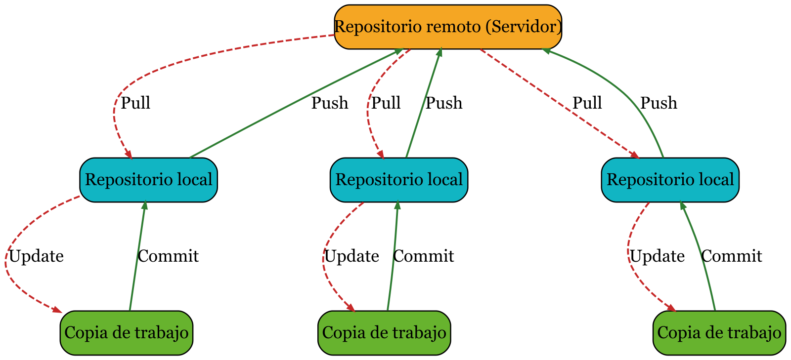
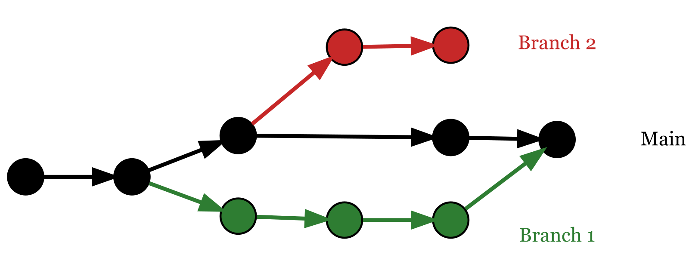
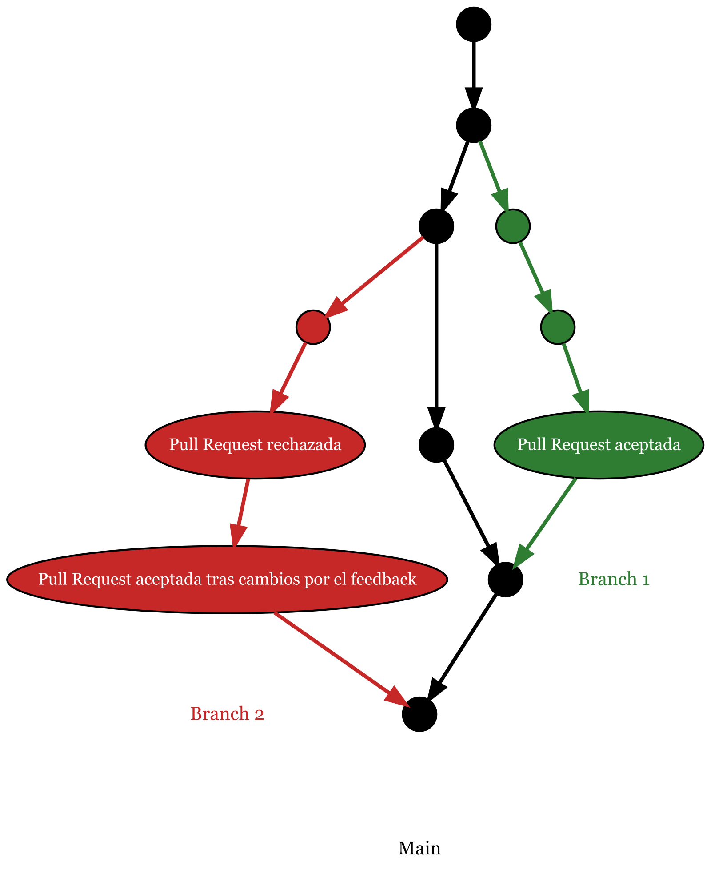

```{r setup, include=FALSE}
knitr::opts_chunk$set(
  echo = TRUE, # Muestra el codigo del chunk.  
  results = "markup", # Función por defecto, pero por si acaso se pone. Significa que se pone la ejecución de cada chunk justamente debajo. Por ejemplo si se realiza un plot de un gráfico, se muestra debajo del código.
  message = FALSE, # Oculta los mensajes que pueden aparecer por defecto en cada libreria.
  warning = FALSE # Oculata las advertencias.
)
```

```{r echo=FALSE}
library(DiagrammeR)
library(DiagrammeRsvg)
library(rsvg)
library(kableExtra)
library(DBI)
library(RSQLite)
```

\newpage

# Introducción.

En este documento, se podrán encontrar los conocimientos básicos sobre las siguientes herramientas:

- Git, y como server online del mismo GitHub.
- Linux.
- Python.
- Docker.
- SQL.

El objetivo final para mi es llegar a comprender los fundamentos de las herramientas anteriormente mencionadas. Aunque este documento lo publico por si hay alguna persona a la que le pueda llegar a ayudar. 

Los conocimientos con los que ha sido redactado este documento son los adquiridos durante el módulo de Fundamentos del Master en Big Data que me encuentro en la actualidad cursando. 

Cabe recalcar que ni mucho menos lo que esta en el presente documento es todo lo que se puede llegar a saber sobre las herramientas anteriormente mencionadas.

La manera de contactar conmigo (creador del documento) o de ver 

- **Linkedin:** www.linkedin.com/in/javiplazarosique 

- **GitHub:** https://github.com/JaviPlazaRosique 

- **Correo electrónico:** j.plazarosique@gmail.com

\newpage 

# Git.

**Git** es un sistema de control de versiones. Sirve para guardar el historial de cambios de los archivos de un proyecto, y también sirve para poder coordinar el trabajo entre varias personas sin que unos se pisen a otros.

## Bases de Git.

Para entender el funcionamiento de Git, antes hay que tener varios conceptos claros. Los conceptos son los siguientes:

- Repositorio.
- Flujo de trabajo con Git: commit, update, push, pull.

Un **repositorio** de Git es una carpeta (como cualquier carpeta del ordenador), en donde se encuentra un subdirectorio (como un archivo) oculto llamado .git, en el cual se guardan los datos de las versiones de los cambios producidos dentro del repositorio. Al poder llegar a tener el subdirectorio descargado en el ordenador, no es necesario tener conexion a internet, pues todos los cambios se encuentran el subdirectorio, por lo que podremos realizar cualquier acción. El repositorio se puede encontrar en local (una capeta del ordenador) o en remoto. Los repositorios en remoto son copias de los repositorios alojados en servidores externos o en la nube, esto permite realizar el trabajo en equipo. Uno de los servicios de repositorios en remoto más extendido es GitHub, pero también se pueden encontrar otros como GitLab.

**Commit** es la acción que realizamos cada vez que realicemos cambios en el proyecto, y queramos guardarlos. En otras palabras un commit es una instantanea del proyecto a la hora de hacerlo. Dichos cambios se guardan en el repositorio local, es decir, en el ordenador. Las características que todo commit tiene son las siguientes: 

- Título.
- Descripción.
- Hash. Un hash es un código único, el cual es único por cada commit.
- Hora.

**Update**, en español actualizar, es llevar al espacio de trabajo la información existente en el repositorio local. 

La acción **Push** envia los commits que se encuentran en el repositorio local (los nuevos, no los que ya están en remoto) al repositorio remoto. Con esta acción pueden surgir conflictos, es decir, cuando se intenta escribir por ejemplo en una línea ene la qeu ya había información. La solución del conflicto no la realiza ni Git, ni GitHub, dará error. Será la misma persona que realize el push u otra persona la que decide que hacer con el conflicto.

**Pull** es el update entre repositorios, es decir, que lleva al repositorio local la información recogida en el repositorio remoto. Al igual que en el push, también pueden surgir conflictos. En este caso los conflictos son más complicados que aparezcan, pues se supone que si alguien va a trabajar sobre un proyecto ya empezado, antes se bajará el proyecto al ordenador. 

A continuación se encuentra una imagen, que refleja el flujo de trabajo con Git, con lo explicado anteriormente. 

```{r echo=FALSE}
funcionamientoGit <- "digraph {
  rankdir = TB
  graph [ranksep=1, nodesep=1, splines=true]
  node  [shape=box, style=\"rounded,filled\", color=\"#444\", fontsize=14]
  edge  [color=\"#555\", fontcolor=\"#222\", arrowsize=0.5]
  
  RR [label=\"Repositorio remoto (Servidor)\", fillcolor=\"#F5A623\"]
  RL1 [label=\"Repositorio local\", fillcolor=\"#11B5C3\"]
  RL2 [label=\"Repositorio local\", fillcolor=\"#11B5C3\"]
  RL3 [label=\"Repositorio local\", fillcolor=\"#11B5C3\"]
  CT1 [label=\"Copia de trabajo\", fillcolor=\"#67B32E\"]
  CT2 [label=\"Copia de trabajo\", fillcolor=\"#67B32E\"]
  CT3 [label=\"Copia de trabajo\", fillcolor=\"#67B32E\"]
  
  RR -> RL1 [label=\"Pull\", penwidth=1.5, style=dashed, color=\"#C62828\"]
  RR -> RL2 [label=\"Pull\", penwidth=1.5, style=dashed, color=\"#C62828\"]
  RR -> RL3 [label=\"Pull\", penwidth=1.5, style=dashed, color=\"#C62828\"]
  
  RL1 -> RR [label=\"Push\", penwidth=1.5, color=\"#2E7D32\"]
  RL2 -> RR [label=\"Push\", penwidth=1.5, color=\"#2E7D32\"]
  RL3 -> RR [label=\"Push\", penwidth=1.5, color=\"#2E7D32\"]
  
  RL1 -> CT1 [label=\"Update\", penwidth=1.5, style=dashed, color=\"#C62828\"]
  RL2 -> CT2 [label=\"Update\", penwidth=1.5, style=dashed, color=\"#C62828\"]
  RL3 -> CT3 [label=\"Update\", penwidth=1.5, style=dashed, color=\"#C62828\"]
  
  CT1 -> RL1 [label=\"Commit\", penwidth=1.5, color=\"#2E7D32\"]
  CT2 -> RL2 [label=\"Commit\", penwidth=1.5, color=\"#2E7D32\"]
  CT3 -> RL3 [label=\"Commit\", penwidth=1.5, color=\"#2E7D32\"]
}"

funGit <- DiagrammeR::grViz(funcionamientoGit)
funGit_image <- DiagrammeRsvg::export_svg(funGit)
rsvg::rsvg_png(charToRaw(funGit_image), file = "funcionamientoGit.png", width = 1600)
```

```{r, echo=FALSE, out.width="100%", fig.align='center'}

```

Además de lo explicado anteriormente, Git también permite realizar ramificaciones. Una rama es una línea de desarrollo independiente, que permite realizar cambios y probar nuevas cosas sin afectar a la rama principal. También permite trabajar en conjunto con un equipo, teniendo cada uno su rama. Las ramas pueden nacer de la rama principal, que por convención se llama "main" (anteriormente "master"), pero también pueden nacer de otras ramas. Cuando se termina el trabajo en una rama, se une (merge) a la rama de la que salió, pasando a la misma todos los commits realizados en la rama. Al realizar la unión entre ramas pueden ocurrir conflictos si se trabaja en las dos ramas implicadas. 

**Importante**. Es recomendable nunca trabajar en la rama principal.

A continuación se puede observar una imagen donde se ve visualmente el funcionamiento de las ramas en Git.

```{r echo=FALSE}
ramasGit <- "digraph {
  rankdir = LR
  graph [bgcolor=transparent, nodesep=0.3, ranksep=0.5]
  node  [shape=circle, width=0.25, fixedsize=true, fontsize=9, color=black]
  
  m1 [label=\"\", color=black, fillcolor=black, style=filled]
  m2 [label=\"\", color=black, fillcolor=black, style=filled]
  m3 [label=\"\", color=black, fillcolor=black, style=filled]
  m4 [label=\"\", color=black, fillcolor=black, style=filled]
  m5 [label=\"\", color=black, fillcolor=black, style=filled]
  
  r11 [label=\"\", color=black, fillcolor=\"#2E7D32\", style=filled]
  r12 [label=\"\", color=black, fillcolor=\"#2E7D32\", style=filled]
  r13 [label=\"\", color=black, fillcolor=\"#2E7D32\", style=filled]
  
  r21 [label=\"\", color=black, fillcolor=\"#C62828\", style=filled]
  r22 [label=\"\", color=black, fillcolor=\"#C62828\", style=filled]
  
  r31 [label=\"\", color=black, fillcolor=\"#11B5C3\", style=filled]
  
  m1 -> m2 -> m3 -> m4 -> m5 [color=black, penwidth=2]
  
  m2 -> r11 -> r12 -> r13 -> m5 [color=\"#2E7D32\", penwidth=2, weight=1, splines=true]
  
  m3 -> r21 -> r22 [color=\"#C62828\", penwidth=2, weight=1, splines=true]

  r22 -> r31 [color=\"#11B5C3\", penwidth=2, weight=1, splines=true]
  
  main [shape=none, label=\"Main\", fontcolor=black, fontsize=10]
  rama1 [shape=none, label=\"Branch 1\", fontcolor=\"#2E7D32\", fontsize=10]
  rama2 [shape=none, label=\"Branch 2\", fontcolor=\"#C62828\", fontsize=10]
  rama3 [shape=none, label=\"Branch 3\", fontcolor=\"#11B5C3\", fontsize=10]
  
  m5  -> main  [style=invis]  
  r13 -> rama1   [style=invis]   
  r22-> rama2 [style=invis]
  r31-> rama3 [style=invis]
}"

ramGit <- DiagrammeR::grViz(ramasGit)
ramGit_image <- DiagrammeRsvg::export_svg(ramGit)
rsvg::rsvg_png(charToRaw(ramGit_image), file = "ramasGit.png", width = 1600)
```

```{r, echo=FALSE, out.width="100%", fig.align='center'}

```

Dentro de un repositorio de Git, se pueden crear una serie de archivos con funcionalidades especificas. Dichos archivos son el archivo llamado ".gitignore" y el archivo llamado ".gitkeep". Las funciones de cada archivo son las siguientes:

- **.gitkeep**. El archivo permite crear una carpera dentro del repositorio de git, sin la necesidad de tener que crear un archivo con contenido. Se emplea cuando se quiere crear la estructura del repositorio (carpetas), y aun no se quiere empezar a trabajar en el. 

- **.gitignore**. El archivo sirve para excluir algunos archivos, por el motivo que sea. Al excluirlos, no los elimina, pero si que no los ratrea ni incluye en los commits. Los motivos para excluir algunos archivos pueden ser variados, pero los más comunes son por las vulnerabilidades que se pueden causar (contraseñas o similar) o por el tamaño de los archivos. 

Las acciones que permite hacer Git como los commits, los push y los demás, se pueden hacer mediante interfaces simples, como puede ser el ejemplo de GitHub, el cual trabaja a partir de GitHub Desktop (luego se verá). Pero para poder trabajar sin una interfaz u en una interfaz que no "tengamos controlada", también se puede trabajar por comandos desde el bash.

De manera sencilla bash es un interprete de comandos del sistema, que nos permite realizar acciones como crear capetas, movernos por el ordenador (todo esto se verá en la parte de Linux), pero también permite tabajar con varias herramientas entre las cuales está Git. Según el sistema operativo del ordenador se puede usar el bash de manera diferente. Desde MacOS y Linux, viene por defecto en la terminal, y en Windows se puede emplear desde GitBash, el cual se instala junto a Git.

## Comandos Git.

Los comandos más importantes para usar Git son los siguientes:

**Creación del repositorio.**

Si se quiere crear el repositorio en el directorio actual, es decir, si la carpeta en la que estamos situados queremos convertirla en un repositorio.

```{bash eval=FALSE}
git init 
```

En el caso de que queramos crear un repositorio de cero, se puede usar lo siguiente. Esto crea el repositorio (carpeta) con el nombre que se escriba en "<directorio>". Para que se entienda, si estamos en una carpeta del ordenador, crea una carpeta dentro de ella con el nombre introducido, siendo esta el repositorio.

```{bash eval=FALSE}
git init <directorio>
```

**Conexión del repositorio local con el repositorio remoto.**

En el caso de conectar un repositorio local con un repositorio remoto, se puede hacer en ambas vías. Es decir que se puede conectar un repositorio local con contenido a un repositorio remoto vacío (creado) o se puede conectar un repositorio remoto al ordenador creando así un repositorio local con el contenido existente en el repositorio remoto.

Para conectar un repo local con uno remoto, antes tenemos que crear un repositorio remoto. Dicho repo se quedará vacío, ya que va a tener los archivos del repo local al conectarlos. Para hacer esto se escribe el siguiente comando en el bash:

```{bash eval=FALSE}
git remote add origin <URL del repositorio remoto>

# origin es el nombre por el que git identifica al repo remoto, se usa ese nombre
# por convención.
```

En el caso contrario se utilizará el siguiente comando, y esto se realizará unicamente la primera vez que "bajemos" el repo.

```{bash eval=FALSE}
git clone <URL del repositorio remoto>
```

**¿Cuál es la situación?**

Para contestar a esta pregunta, existe un comando. Dicho comando nos muestra tres cosas:

- En que rama nos encontramos.
- Los archivos que han sido modificados.
- De los archivos que han sido modificados, cuales están preparados para hacer un commit. 

El comando descrito es el siguiente: 

```{bash eval=FALSE}
git status
```

**¿Cómo le cominicamos a Git que un archivo está preparado para hacer el commit?**

Para comunicarle a Git que archivos están listos para ser commiteados, antes se le tiene que dar a guardar (si está guardado, git sabe que se ha modificado) y emplear el siguiente comando: 

```{bash eval=FALSE}
git add <Nombre del archivo>
```

**Commit.**

Ya sabiendo lo que es un commit, el comando que hará uno con los archivos que anteriormente se hayan añadido es el siguiente: 

```{bash eval=FALSE}
git commit -m "<Título del commit>"

# -m se pone para poner un mensaje, en este caso es el título del commit.
```

En el caso de que se haya realizado un commit, el cual es erroneo, se puede revertir empleando el siguiente comando: 

```{bash eval=FALSE}
git revert <Primera parte del hash>

# Con primera parte del hash, se pueden emplear los caracteres que hagan único
# el hash, deberían de bastar 6 o 7, pero se puede utilizar entero.

git revert HEAD

# HEAD significa el último commit realizado.
```

**¿Cómo puedo saber el hash de un commit?**

Para poder saber el hash de un commit, se puede acceder al historial de cambios en el proyecto. Esto se hace mediante el siguiente comando:

```{bash eval=FALSE}
git log 
```

**Push.**

Ya sabiendo lo que es un push, para hacer uno con los nuevos commits, se debe de utilizar el siguiente comando: 

```{bash eval=FALSE}
git push origin <Nombre de la rama a la que queremos hacer el push>
```

**Pull.**

Ya sabiendo lo que es un pull, el comando que se debe emplear para hacer uno es el siguiente: 

```{bash eval=FALSE}
git push origin <Nombre de la rama a la que queremos hacer el pull>
```


**¿Cómo crear una rama?**

Para crear una nueva rama, la cual se conecta a la rama en la que estamos situados, se utilizará el siguiente comando:

```{bash eval=FALSE}
git branch <Nombre que queremos ponerle a la rama>
```

**¿Cómo me puedo cambiar entre rama?**

Para cambiar de una rama a otra, se debe de usar el siguiente comando:

```{bash eval=FALSE}
git switch <Nombre de la rama a la que queremos cambiar>
```

**¿Cómo puedo unir una rama con la rama de la que sale?**

Para poder unir una rama con la rama de la que sale, primero debemos de encontrarnos en la rama de la que sale. Por ejemplo, si una ramma llamada "Rama 1" sale de main, para poder unir dicha rama con main, debemos de encontrarnos en main. Una vez estemos en la rama de la que sale, debemos de utilizar el siguiente comando: 

```{bash eval=FALSE}
git merge <Nombre de la rama que queremos unir>
```

**¿Cómo puedo eliminar una rama?**

Para poder eliminar una rama, se debe de emplear el siguiente comando:

```{bash eval=FALSE}
git branch -d <Nombre de la rama que queremos eliminar>

# -d se emplea cuando la rama ya está mergeada, si no lo está, no se podrá borrar

# Para forzar la eliminación de la rama, se debe de cambiar -d por -D
```

## Servicio de repositorio remoto: GitHub.

**GitHub** es una plataforma en la nube que permite guardar y compartir proyectos que usan Git.
Sirve para colaborar en equipo, revisar código y mantener un historial de versiones online de tus repositorios.

La parte más atractiva de GitHub, a la hora de compartir proyectos o de realizar tus propios proyectos son las Pull Request. Una Pull Request es una petición para que tus cambios se unan a la rama principal de un proyecto. Sirve para que otros revisen y aprueben tu código antes de fusionarlo.

Para entender el funcionamiento de las Pull Request, es más sencillo con la siguiente imagen. 

```{r echo=FALSE}
PR <- "digraph {
  rankdir = TB
  graph [bgcolor=transparent, nodesep=0.3, ranksep=0.5]
  node  [shape=circle, fontsize=9, color=black]
  
  m1 [label=\"\", fillcolor=black, style=filled, fixedsize=true, width=0.25]
  m2 [label=\"\", fillcolor=black, style=filled, fixedsize=true, width=0.25]
  m3 [label=\"\", fillcolor=black, style=filled, fixedsize=true, width=0.25]
  m4 [label=\"\", fillcolor=black, style=filled, fixedsize=true, width=0.25]
  m5 [label=\"\", fillcolor=black, style=filled, fixedsize=true, width=0.25]
  m6 [label=\"\", fillcolor=black, style=filled, fixedsize=true, width=0.25]
  
  r11 [label=\"\", fillcolor=\"#2E7D32\", style=filled, fixedsize=true, width=0.25]
  r12 [label=\"\", fillcolor=\"#2E7D32\", style=filled, fixedsize=true, width=0.25]
  r13 [label=\"Pull Request aceptada\", color=black, fillcolor=\"#2E7D32\", style=filled, shape=ellipse, fontcolor=white, fontsize=9]
  
  r21 [label=\"\", fillcolor=\"#C62828\", style=filled, fixedsize=true, width=0.25]
  r22 [label=\"Pull Request rechazada\", color=black, fillcolor=\"#C62828\", style=filled, shape=ellipse, fontcolor=white, fontsize=9]
  r23 [label=\"Pull Request aceptada tras cambios por el feedback\", color=black, fillcolor=\"#C62828\", style=filled, shape=ellipse, fontcolor=white, fontsize=9]
  
  m1 -> m2 -> m3 -> m4 -> m5 -> m6 [color=black, penwidth=2]
  
  m2 -> r11 -> r12 -> r13 -> m5 [color=\"#2E7D32\", penwidth=2, weight=1, splines=true]

  m3 -> r21 -> r22 -> r23 -> m6 [color=\"#C62828\", penwidth=2, weight=1, splines=true]
  
  main [shape=none, label=\"Main\", fontcolor=black, fontsize=10]
  rama1 [shape=none, label=\"Branch 1\", fontcolor=\"#2E7D32\", fontsize=10]
  rama2 [shape=none, label=\"Branch 2\", fontcolor=\"#C62828\", fontsize=10]
  
  m6  -> main  [style=invis]  
  r13 -> rama1   [style=invis]   
  r23 -> rama2   [style=invis]
}"

PullR <- DiagrammeR::grViz(PR)
PR_image <- DiagrammeRsvg::export_svg(PullR)
rsvg::rsvg_png(charToRaw(PR_image), file = "PullRequest.png", width = 1600)
```

```{r, echo=FALSE, out.width="100%", fig.align='center'}

```

Además de las Pull Request, GitHub ofrece otras funcionalidades. Una interesante puede ser realizar un Fork sobre un repositorio, que pertenezca a otro usuario. Realizar un Fork sobre un repo de otra persona es como hacer un copia y pega de su repositorio en los tuyos, y todos los cambios que se hagan, se hacen sobre tu copia sin afectar al repo original. A simple vista parece la función de clonar, pero es diferente. Al clonar el repositorio los cambios se mandarían por una PR al dueño del repo. 

\newpage

# Linux.

Linux es un sistema operativo libre y de código abierto. Es un sistema estable, rápido y completamente personalizable. 

La importancia de aprender sobre linux radica en que es el sistema base en ciencia de datos e IA. Y además los servidores en la nube funcionan con linux. 

\newpage

# Python.

Python es un lenguaje de programación considerado de alto nivel. Es muy popular y usado por los siguientes motivos:

- Es facil de aprender y leer al ser parecido al lenguaje humano (el inglés).
- Es multipropósito, sirve tanto para desarrollo web, como para análisis de datos, o incluso para videojuegos, entre otros. 
- Al estar muy extendido existe una gran comunidad que lo emplea y una gran cantidad de librerías. 

## Mostrar por consola. 

Para poder mostrar por consola el argumento que queramos, se deberá de emplear el siguiente comando:

```{python eval=FALSE}
print()

# Entre paréntesis se introducirá el argumento que queramos mostrar, este puede 
# ser una variable predefinida, una cadena de texto, entre otras opciones.
```

Por ejemplo, mostraremos Hola, Mundo por consola. 

```{python}
print("Hola, Mundo")
```

## Variables. 

Una variable es un dato en forma de texto, de forma numérica u otro tipo, al que se le asigna un nombre. 

Una variable se declarará del siguiente modo: 

```{python eval=FALSE}
<Nombre de la variable> : <Tipo de dato> = <Dato>
```

En Python, no es necesario asignar el tipo de dato, pues se asigna solo. Sin poner el tipo de dato, se escribiría del siguiente modo:

```{python eval=FALSE}
<Nombre de la variable> = <Dato>
```

Para poder nombrar variables se deben tener varías reglas en cuenta: 

- No pueden empezar por números, pero si pueden contenerlos. 
- No pueden contener ni espacios ni guiones. Aunque si que pueden contener: 
  - Letras, teniendo encuenta que Python distingue entre mayusculas y minusculas. 
  - Guiones bajos (_)
  - Números
- No se pueden usar la palabras reservadas. La lista de las palabras reservadas se pueden obetener del siguiente modo: 

```{python}
import keyword 

# Se importa este módulo (se verá más tarde) donde esta la lista de las 
# palabras reservadas.

# Para mostrar la lista, y que se puedan ver todas las palábras, se usará un 
# bucle, que se explicará más tarde.

for palabraReservada in keyword.kwlist:
  print(palabraReservada)
```

## Tipos de datos.

En Python existen diferentes tipos de datos, los cuales están recogidos en la siguiente tabla. 

```{r echo=FALSE}
tipos_python <- data.frame(
  Categoría = c(
    "Numérico", "", "",
    "Secuencia", "", "",
    "Conjunto", "",
    "Mapeo",
    "Booleano", "Nulo"
  ),
  Tipo = c(
    "int", "float", "complex",
    "str", "list", "tuple",
    "set", "frozenset",
    "dict",
    "bool", "NoneType"
  ),
  Descripción = c(
    "Enteros (1, 2, 3)",
    "Reales con decimales (3.14)",
    "Números complejos (3 + 2i)",
    "Cadenas de texto",
    "Listas mutables",
    "Tuplas inmutables",
    "Conjuntos mutables (sin duplicados)",
    "Conjuntos inmutables",
    "Diccionarios (clave:valor)",
    "Valores lógicos True/False",
    "Ausencia de valor"
  ),
  check.names = FALSE
)

knitr::kable(
  tipos_python,
  format = "latex",
  booktabs = TRUE,
  align = rep("c", ncol(tipos_python)) 
) |>
  kableExtra::kable_styling(
    full_width = FALSE,     
    position   = "center",   
    latex_options = "hold_position"  
  )
```

Para saber que tipo de dato es un dato, se puede usar el siguiente comando:

```{python eval=FALSE}
type()

# Entreparéntesis, se meterá o bien directamente el dato o bien el nombre que 
# se le haya asignado (variable).
```

Dejo varios ejemplos para que se aprecie su funcionamiento. 

```{python}
print(type(6))

print(type('Hola'))

print(type(True))
```

### Tipos numéricos.

Como se ha observado en la tabla del inicio, dentro de los tipos de datos numéricos encontramos tres tipos diferentes. Los cuales son los siguientes: 

- Enteros (int)
- Reales con decimales (float)
- Números complejos (complex)

Cuando utilizamos este tipo de dato, no se pone entre comillas.

Los numeros complejos (a + bi) se escribirán de la siguiente forma (a + bj), o incluso se pueden escribir con el siguiente comando:


```{python eval=FALSE}
complex(a, b)

# Siendo a la parte real y b la parte imaginaria.
```

A modo de prueba se le asignará un nombre a una varible con cada uno de los tipos de datos numéricos.

```{python}
entero = 1
flotante = 1.1
complejo = 1+2j

# Para comprobar si se han escrito bien los datos, usaremos la funcion type()

print(type(entero))
print(type(flotante))
print(type(complejo))
```

Los tipos de datos numéricos se usan principalmente para realizar operaciones numéricas entre otras cosas. 

### Tipos secuenciales.

Como se ha observado en la tabla del inicio, dentro de los tipos de datos secuenciales encontramos tres tipos diferentes. Los cuales son los siguientes: 

- Cadenas de texto (str)
- Listas mutables (list)
- Tuplas inmutables (tuple)

#### Cadena de texto o strig (str).

Las cadenas de texto pueden contener letras, números, signos, etc. Estas se definen entre comillas, sirviendo tanto las comillas dobles como las simples. 

Además se pueden introducir otras variables en una cadena de texto, para ello se puede usar la f, la cual se emplea de la siguiente manera:

```{python eval=FALSE}
f"...........{<Aqui se pone el nombre de la variable>}................"
```

Por ejemplo, aquí tienes el resultado de emplear la f para juntar una cadena de texto con cualquier otra variable. 

```{python}
print(f"El número entero de antes es {entero}, mientras que el complejo es {complejo}")
```

A modo de prueba se le asignara a una variable un dato de tipo texto, para comprobar como sería y poder así también comprobar como funcionan algunos métodos de este tipo de dato. 

```{python}
texto = "hola"

texto2 = 'adiós'

# Para comprobar si se han escrito bien los datos, usaremos la funcion type()

print(type(texto))

print(type(texto2))
```

Para poder sacar una letra o un rango de caracteres de un dato de tipo texto, se usa el siguiente comando:

```{python eval=FALSE}
<Nombre de la variable>[<Aquí se pone la posición o rango que queramos extraer>]

# 0 es la primera posición,
# Con -1 tendríamos la última posición.
# El rango compredido entre la posicion X y la Y, se escribiría X:Y.
```

A continuación habrá una demostración de esto.

```{python}
print(texto[0])

print(texto[-1])

print(texto[2:3])
```

Además de extraer el caractér de la posición que queramos de una str, también podemos realizar otras opciones. A las funciones que realizan acciones sobre algún tipo de dato se llaman métodos. A continuación vendrán los métodos más empleados de los str, junto con una prueba de cada uno de ellos. 

```{python eval=FALSE}
len(<Nombre de la variable>) 

# Dice la longitud del texto.
```

```{python}
print(len(texto))
```

```{python eval=FALSE}
<Nombre de la variable>.upper()

# Devuelve todo el texto en mayúsculas
```

```{python}
print(texto.upper())
```

```{python eval=FALSE}
<Nombre de la variable>.lower()

# Devuelve todo el texto en minusculas
```

```{python}
print(texto.lower())
```

```{python eval=FALSE}
<Nombre de la variable>.capitalize()

# Devuelve la primera letra del texto en mayúsculas
```

```{python}
print(texto.capitalize())
```

```{python eval=FALSE}
<Nombre de la variable>.title()

# Devuelve en mayúsculas la primera letra de cada palabra
```

```{python}
# Para esta prueba se crea una variable con varias palabras

texto3 = "estoy programando con python"

print(texto3.title())
```

```{python eval=FALSE}
<Nombre de la variable>.count("<argumento>")

# Devuelve cuantas veces se repite el argumento dentro del texto
```

```{python}
print(texto3.count("o"))
```

```{python eval=FALSE}
<Nombre de la variable>.startswith("<argumento>")

# Devuelve True o False dependiendo de si el texto empieza con el argumento
```

```{python}
print(texto3.startswith("estoy"))
```

```{python eval=FALSE}
<Nombre de la variable>.endswith("<argumento>")

# Devuelve True o False dependiendo de si el texto termina con el argumento
```

```{python}
print(texto3.endswith("estoy"))
```

#### Listas mutables (list)

Las listas son colecciones ordenadas y modificables (mutables) de elementos. Las listas no continen claves y dentro de sus elementos no tienen porque ser todos del mismo tipo de dato. Es decir, que dentro de una lista se pueden encontrar datos numéricos, de tipo texto, o incluso otra lista. 

Las listas se definen de la siguiente manera:

```{python eval=FALSE}
<Nombre de la lista> = [<Elemento>, <Elemento>, <Elemento>, ...]
```

Para comprobar que las listas se definen como anteriormente se ha comentado, se creará una. Así también se podrá emplear para probar sus métodos. 

```{python}
lista = ["Hola", "Adiós", 1, 1+2j, ["día", "noche"]]

# Para comprobar si se han escrito bien los datos, usaremos la funcion type()

print(type(lista))
```

Al igual que los str y todos los tipos de datos, existen métodos útiles para el empleo de los datos. En el caso de las listas, los métodos más empleados son los que están a continuación, junto con una prueba de cada uno con la lista creada anteriormente.

Para comenzar, en las cadenas de texto se puede acceder al carácter, que se encuentra en la posición que queramos. Pues en las listas podemos acceder al elemento que se encuentre en la posición que queramos. Además si un elmento es de tipo texto, tambien podemos acceder al caracter que este en la posición que queramos la mismo tiempo. 

```{python eval=FALSE}
<Nombre de la lista>[<Posición>]

# Las posiciones funcionan igual que en las cadenas de texto

<Nombre de la lista>[<Posición en la lista>][<Posición en el texto>]

# Para hacer esto, el elemento de la lista debe ser de tipo str. Se puede saber 
# de la siguiente manera.

type(<Nombre de la lista>[<Posición en la lista>])
```

```{python}
print(lista[0])

print(lista[-1])

print(type(lista[0]))

print(lista[1][0])
```

A continuación estarán los demás métodos, sin estar todos, puesto que existen muchos. En el caso de querer saber más, hay que recurrir a la documentación.

```{python eval=FALSE}
<Nombre de la lista>.append(<Elemento>)

# Añade el elemento al final de la lista
```

```{python}
lista.append(5)

print(lista)
```

```{python eval=FALSE}
<Nombre de la lista>.insert(<Posición>, <Elemento>)

# Añade el elemento en la posición que queramos. Si la posición es central, 
# Los elementos que vayan después, se desplazarán una posición.
```

```{python}
lista.insert(3,"Posición 3")

print(lista)
```

```{python eval=FALSE}
<Nombre de la lista>.remove(<Elemento>)

# Elimina el elemento de la lista con ese nombre
```

```{python}
lista.remove("Hola")

print(lista)
```

```{python eval=FALSE}
<Nombre de la lista>.pop(<Posición>)

# Elimina el elemento de la lista que se encuentre en esa posición

# También se puede emplear el siguiente:

del Nombre_de_la_lista[<Posición>]
```

```{python}
lista.pop(-1)

print(lista)

del lista[0]

print(lista)
```

```{python eval=FALSE}
len(<Nombre de la lista>)

# Cuenta el número de elementos dentro de una lista.
```

```{python}
print(len(lista))
```

#### Tuplas inmutables (tuple).

Las tuplas son como las listas, pero cuyo contenido no se puede modificar (es inmutable). 

Las tuplas se definen de manera similar a las listas, lo único que cambia es que en la lista se emplean [], y en las tuplas (). Se definirían del siguiente modo:

```{python eval=FALSE}
<Nombre de la tupla> = (<Elemento>, <Elemento>, <Elemento>, ...)
```

Para comprobar que las tuplas se definen como se ha comentado, se generará una tupla. Y además se podrá emplear para probar sus métodos.

```{python}
tupla = ["Hola", "Adiós", 1, 1+2j, ["día", "noche"]]

# Para comprobar si se han escrito bien los datos, usaremos la funcion type()

print(type(tupla))
```

En el caso de las tuplas, al ser inmutables, no existen métodos que las modifiquen. Aunque si que existen algunos métodos para realizar operaciones con ellas, entre otras cosas.

La forma de acceder a cualquier elemento de la tupla es la misma forma que en las listas. 

```{python eval=FALSE}
<Nombre de la tupla>.count(<Elemento>)

# Devuelve el número de elementos que coincide con el elemento introducido.
```

```{python}
print(tupla.count(1))
```

```{python eval=FALSE}
len(<Nombre de la tupla>)

# Devuelve el número de elementos que hay en la lista
```

```{python}
print(len(tupla))
```

Como se ha comentado anteriormente, hay métodos que permiten realizar operaciones matemáticas con los elementos de las tuplas. Para comprobar algunos, se generará una tupla con elementos de tipo numérico.

```{python}
tuplaNumerica = (1, 2, 3, 4, 5)
```

```{python eval=FALSE}
max(<Nombre de la tupla>)

# Devuelve el número más alto que se encuentre dento de la tupla.
```

```{python}
print(max(tuplaNumerica))
```

```{python eval=FALSE}
sum(<Nombre de la tupla>)

# Devuelve la suma de todos los elemntos del interior de la tupla.
```

```{python}
print(sum(tuplaNumerica))
```

```{python eval=FALSE}
sorted(<Nombre de la tupla>)

# Devuelve la tupla de manera ordenada, esta opcion tambien existe en las listas,
# y se pueden ordenar siguiendo alguna norma. Su funcionamiento general es:

sorted(<Nombre variable>, key = <regla de ordenacion, ej. len>, reverse = True)

# Reverse = True, saca la lista invertida a como saldría sin ponerla.
```

```{python}
print(sorted(tuplaNumerica))
```

Para probar el método sorted, tambien con una tupla con unicamente texto, se creará una nueva tupla.

```{python}
tuplaTexto = ("Hola", "Adiós", "uno", "esternocleidomastoideo")

print(sorted(tuplaTexto, key=len)) # Ordena por longuitud

print(sorted(tuplaTexto, key=len, reverse=True)) # Ordenada de más largo a menos
```

### Tipos de conjuntos.

Como se ha observado en la tabla del inicio, dentro de los tipos de datos que son conjuntos encontramos dos tipos diferentes. Los cuales son los siguientes: 

- Conjuntos mutables (set)
- Conjuntos inmutables (frozenset)

Tanto los conjuntos mutables como los inmutables, son similares al funcionamiento de las listas y las tuplas. La única diferencia es que en los conjunto no se pueden repetir elementos. A efectos prácticos, los conjuntos mutables funcionan como las listas y los conjuntos inmutables funcionan como las tublas. 

La manera de definir los conjuntos mutables es la siguiente:

```{python eval=FALSE}
<Nombre del conjunto mutable> = [<Elemento>, <Elemento>, <Elemento>, ...]

<Nombre del conjunto mutable> = set(Nombre_del_cojunto_mutable)

# Tambiém se puede hacer sin generar una lista anteriormente

<Nombre del conjunto mutable> = set([<Elemento>, <Elemento>, <Elemento>, ...])
```

Para comprobar que es así, se genera un conjunto mutable. Teniendo en cuenta que los métodos de las listas son los mismos que el de los conjuntos mutables, no se probará ninguno, pues el funcionamiento es el mismo.

```{python}
conjuntoMutable = [1,2,2,2,3,4,5,5,6]

conjuntoMutable = set(conjuntoMutable)

print(conjuntoMutable)

# Para comprobar si se han escrito bien los datos, usaremos la funcion type()

print(type(conjuntoMutable))
```

La manera de definir los conjuntos mutables es la siguiente:

```{python eval=FALSE}
<Nombre del conjunto inmutable> = [<Elemento>, <Elemento>, <Elemento>, ...]

<Nombre del conjunto inmutable> = frozenset(Nombre_del_cojunto_inmutable)

# Tambiém se puede hacer sin generar una lista anteriormente

<Nombre del conjunto inmutable> = frozenset([<Elemento>, <Elemento>, <Elemento>, ...])
```

Para comprobar que es así, se genera un conjunto inmutable. Teniendo en cuenta que los métodos de las tuplas son los mismos que el de los conjuntos inmutables, no se probará ninguno, pues el funcionamiento es el mismo.

```{python}
conjuntoInmutable = ['A','A','B','C','D','D']

conjuntoInmutable = frozenset(conjuntoInmutable)

print(conjuntoInmutable)

# Para comprobar si se han escrito bien los datos, usaremos la funcion type()

print(type(conjuntoInmutable))
```

### Diccionarios (dict).

Los diccionarios son colecciones de pares **clave:valor**. Los pares clave:valor son como una caja con etiquetas, cada etiqueta (clave) tiene algo guardado dentro (valor). El valor puede ser cualquier tipo de dato, incluyendo hasta a los mismos diccionario, mientras que las claves deben de ese de algún tipo de dato inmutable, sindo el más comun las str

Los diccionarios se definen del siguiente modo:

```{python eval=FALSE}
<Nombre del diccionario> = {<clave>:<valor>, <clave>:<valor>, ...}
```

A modo de prueba, para comprobar como se generan los diccionarios y además poder así probar los métodos de los diccionarios con ejemplos.

```{python}
diccionario = {
  "nombre":"Antonio",
  "edad":55,
  "dirección":{
    "calle":"Calle de la música",
    "número":12
    },
  "colores_favoritos":["azul", "verde", "naranja"]
  }
  
# Para comprobar que lo hemos crado correctamente, probamos con type()

print(type(diccionario))

# Para comprobar los resultados de los métodos y como se vería el diccionario
# completo, se empleará el siguiente bucle (mas tarde se explicarán)

for clave, valor in diccionario.items():
  print(f"{clave}: {valor}")
```

Para poder acceder a cualquier valor que se encuentre dentro del diccionario, se debe emplear el siguiente comando:

```{python eval=FALSE}
<Nombre del diccionario>[<clave>]
```

```{python}
print(diccionario["colores_favoritos"])
```

Al igual que todos los tipos de datos, los diccionarios tienen sus métodos. Algunos de los métodos más utilizados con los diccionarios son los que estarán a continución. 

```{python eval=FALSE}
<Nombre del diccionario>.clear()

# Elimiina todos los elementos del diccionario
```

```{python}
diccionario.clear()

# Se usa el condicional if para poder saber si de verdad viene vacío.

if len(diccionario) == 0:
  print("El diccionario está vacío.")
else:
  for clave, valor in diccionario.items():
    print(f"{clave}: {valor}")
```

Para poder comprobar los demás métodos, se generará nuevo contenido en el diccionario. 

```{python}
diccionario = {
  "nombre":"Antonio",
  "edad":55,
  "dirección":{
    "calle":"Calle de la música",
    "número":12
    },
  "colores_favoritos":["azul", "verde", "naranja"]
  }
```

```{python eval=FALSE}
<Nombre del diccionario>.item()

# Devuelve la clave:valor de todo el diccionario en forma de tupla.

# Este no se prueba, puesto que se usa en el bucle para mostrar los datos. 
```

```{python eval=FALSE}
<Nombre del diccionario>.get(<clave>)

# Devuelve el valor que corresponde a la clave escrita.
```

```{python}
print(diccionario.get("nombre"))
```

```{python eval=FALSE}
<Nombre del diccionario>.keys()

# Devuelve todas las claves del diccionario.
```

```{python}
for clave in diccionario.keys():
  print(clave)
```

```{python eval=FALSE}
<Nombre del diccionario>.values()

# Devuelve todos los valores del diccionario.
```

```{python}
for valor in diccionario.values():
  print(valor)
```

```{python eval=FALSE}
<Nombre del diccionario>.pop(<clave>)

# Elimina la calve y su valor asignado. También serviría:

del <Nombre del diccionario>[<clave>]
```

```{python}
diccionario.pop("nombre")

del diccionario["edad"]

for clave, valor in diccionario.items():
  print(f"{clave}: {valor}")
```

```{python eval=FALSE}
<Nombre del diccionario>[<clave>] = <valor>

# Crea una nueva clave con su valor asignado.
```

```{python}
diccionario[123] = "clave de forma numérica"

for clave, valor in diccionario.items():
  print(f"{clave}: {valor}")
```

### Tipos booleanos (bool).

Los datos de tipo booleano, son de tipo lógico y expresan True o False, en función de si la afirmación es cierta (True) o falsa (False). Funciona principalmente con operadores, pero tambíen se puede definir una variable de este tipo. 

La definición de una variable de este tipo se hará del siguiente modo:

```{python eval=FALSE}
<Nombre de la variable booleana> = True o False
```

Para comprobarlo, se crea una variable de tipo booleano. 

```{python}
booleano = True

# Para comprobar si se han escrito bien los datos, usaremos la funcion type().

print(type(booleano))
```

## Operadores.

Un operador es un símbolo o palabra que indica una operación que se aplica a uno o más valores llamados operandos.

### Operadores aritméticos.

Los operadores aritméticos sirven para realizar cáculos matemáticos elementales entre variables numéricas. Los operadores aritméticos son los siguientes:

- $+$ $\longrightarrow$ Suma.
- $-$ $\longrightarrow$ Resta.
- $*$ $\longrightarrow$ Multiplicación.
- $/$ $\longrightarrow$ División.
- $//$ $\longrightarrow$ División entera (redondea a la baja).
- $\%$ $\longrightarrow$ Módulo o resto de la división.
- $**$ $\longrightarrow$ Potencia.

Se cearán dos variables numéricas para poder realizar las operaciones y comprobar como funcionan y sí realizan las operaciones anteriormente mencionadas. 

```{python}
a = 2
b = 9

print(a + b)
print(a - b)
print(a * b)
print(a / b)
print(a // b)
print(a % b)
print(a ** b)
```

Para comprobar si los operadores aritméticos funcionan también con datos de tipo str, se van a crear dos variables de este tipo. Al mismo tiempo que se prueba con el método (try except), que se explicará más adelante. Los únicos operadores que podrían funcionar aparentemente con este tipo de datos, pueden llegar a ser la suma y la resta, por eso únicamente se probarán estos.

```{python}
a = "Hola"
b = "Adios"

try:
  a + b 
  print(a + b)
except Exception as e:
  print("Error", e)
  
try:
  a - b 
  print(a - b)
except Exception as e:
  print("Error", e)
  
try:
  a - "a" 
  print(a - "a")
except Exception as e:
  print("Error", e)
```

### Operadores de asignación. 

Los operadores de asignación asignan valores a variables y, a veces, realizan operaciones al mismo tiempo. Los operadores de asignación son los siguientes:

- $=$ $\longrightarrow$ Asigna un valor.
- $<Operador\ aritmétivo>=$ $\longrightarrow$ Realiza una operación sobre sí mismo. 

Para comprobar como se puede realizar una operación sobre una variable predefinida, se crea una nueva variable y se prueba esto. 

```{python}
a = 999
a+=1

print(a)
```

### Operadores de comparación.

Los operaciones de coparación permiten comparar valores y devuelven un resultado booleano (True o False). Los operadores de comparación son los siguientes:

- $==$ $\longrightarrow$ Igual que.
- $!=$ $\longrightarrow$ Distinto de.
- $>$ $\longrightarrow$ Mayor que.
- $<$ $\longrightarrow$ Menor que.
- $>=$ $\longrightarrow$ Mayor o igual que.
- $<=$ $\longrightarrow$ Menor o igual que.

Para comprobar como funcionan, se crearán una serie de variables de tipo numérico para poder ver como sería el resultado.

```{python}
a = 12
b = 5.25

print(a == b)
print(a != b)
print(a > b)
print(a < b)
print(a >= b)
print(a <= b)
```

El comportamiento de los operadores de comparación con variables de tipo str, es diferente y algo menos intuitivo. El lenguaje Python interpreta las comparaciones con las siguientes reglas:

- Al emplear == o !=, tiene en cuenta caractér por caractér, teniendo en cuenta las mayusculas y los espacios a la hora de decidir si es verdadera o falsa la afirmación.
- Al emplear los demás operadores (>, <, >=, <=), tiene en cuenta otros criterios, los cuales son los siguientes:
  - Tiene en cuenta primero el numero de caracteres, y en el caso de que el número de caracteres sea el mismo, tiene en cuenta el orden alfabético (dado por Unicode).

Para comporobar esto, se crearán una serie de variables y se emplearán una serie de operadores de comparación.

```{python}
a = "abcd"
b = "abc"
c = "zyx"
e = "ABC"

print(a == b)
print(b != e)
print(a > b)
print(b > c)
```


### Operadores lógicos. 

Los operadores lógicos se usan para combinar condiciones. Devolviendo un valor booleando dependiendo de los argumentos empleados. Los operadores lógicos son los siguientes: 

- **and** $\longrightarrow$ Y $\longrightarrow$ Verdadero si las condiciones combinadas son verdaderas.
- **or** $\longrightarrow$ O $\longrightarrow$ Verdader si una de las condiciones combinadas es verdadera.
- **not** $\longrightarrow$ NO $\longrightarrow$ Invierte el valor lógico.

Para comprobar el funcionamiento de los operadores lógicos, se emplearán una serie de variables que se van a crear a continuación. Como el funcionamiento de los operadores lógicos funcionan en conjunto con los operadores de comparación, solo se comprobarán con variables de tipo numérico.

```{python}
a = 5
b = 10
c = 80

print(type(a) == int and a < b)
print(a > b or b < c)
print(a < b or b < c)
print(not a < b)
```

### Operadores de identidad. 

Los operadores de identidad comparan si dos objetos son el mismo, no solo si tienen el mismo valor. Devolviendo un valor booleano. Los operadores de identidad son los siguientes.

- **is** $\longrightarrow$ Devuelve True si son el mismo objeto. La diferencia con el operador de comparación == es que no compara el valor, si tienen la misma referencia o no. 
- **is not** $\longrightarrow$ Devuelve True si no son el mismo objeto. La diferencia con el operador de comparación != es que no compara el valor, si tienen la misma referencia o no. 

Para comprobar esto, puesto que es algo abstracto, se realizarán varios ejemplos.

```{python}
a = [1, 2]
b = [1, 2]
c = a

print(a is b)
print(a is c)
print(a is not b)
```

### Operadores de pertenencia.

Los operadores de pertenenecia comprueban si un elemento está dentro de una secuencia, ya sea un texto (str), una lista u otra secuencia, devolviendo un valor booleano dependiendo de cuales sean los argumentos empleados. Los tipos de operadores de pertenencia son los siguientes:

- **in** $\longrightarrow$ Es verdadero cuano el elemento esta dentro del otro. 
- **not in** $\longrightarrow$ Es verdadero cuando el elemento no esta dentro del otro. 

Para comprobar su funcionamiento se crearán varios ejemplos de cada uno. 

```{python}
a = [1, 2]
b = "Hola"

print(1 in a)
print("a" in b)
print("h" not in b) # Para demostrar que python diferencia las mayúsculas.
print(" " in b) # Para demostrar que python diferencia los espacios en blanco
```

## Condicionales. 

Los condicionales son instrucciones que ejecutan un bloque de código solo si una condición es verdadera (True). 

Si la condición es falsa (False), puede ejecutar otra parte diferente o no hacer nada, dependiendo de las instrucciones que le pongamos al código. 

Existen dos tipos de condicionales, los cuales son los siguientes:

- El condicional **if-elif-else**.
- El condicional **match-case**.

### IF-ELIF-ELSE.

El condicional if-elif-else, tiene el siguiente funcionamiento:

```{python eval=FALSE}
if <condición>:
  <código que se ejecutará cuando la condición sea cierta>
elif <condición>:
  <código que se ejecutará cuando la condicion sea verdadera y la primera sea falsa>
      . 
      . 
      . # Esto refleja que se pueden poner tantos elif como se quieran
      . 
      . 
elif <condición>:
  <código que se ejecutará cuando la condicion sea verdadera y las anteriores falsas>
else:
  <código que se ejecutará cuando todas las condiciones sean falsas>
```

El funcionamiento con palabras es:

1. Si pasa esto, haz esto. Si no pasa, pasa al siguiente paso.
2. Si pasa esto, haz esto. Si no pasa, pasa al siguiente paso. 
3. Si no ha ocurrido nada de los que se ha dicho anteriormente, haz esto. 

Para ver como funcionaría el condicional se emplearán un par de ejemplos. 

```{python}
persona = {
  'nombre':'Pepe',
  'edad':18
}

if persona['edad'] >= 18:
  print(f'{persona['nombre']} es mayor de edad')
else:
  print(f'{persona['nombre']} es menor de edad')
```

```{python}
persona = {
  'nombre':'Luisa',
  'nota':4.9
}

if persona['nota'] >= 9:
    print(f"{persona['nombre']} tiene un sobresaliente")
elif persona['nota'] >= 7:
    print(f"{persona['nombre']} tiene un notable")
elif persona['nota'] >= 5:
    print(f"{persona['nombre']} tiene un aprobado")
else:
    print(f"{persona['nombre']} esta suspenso, tiene que repetir la prueba")
```

### MATCH-CASE.

El condicional match-case, es menos usado, pero también es interesante conocer su funcionamiento. El funcionamiento es el siguiente: 

```{python eval=FALSE}
match <variable predefinida>:
  case <valor>:
    <código que se ejecutará cuando la variable sea == al valor>
  case <valor>:
    <código que se ejecutará cuando la variable sea == al valor>
        . 
        . 
        . # Esto refleja que se puede poner tantas veces como se quiera case
        . 
        . 
  case _:
    <código que se ejecutará si nunguno de los casos anteriores ocurren>
```

El funcionamiento en palabras de este condicional es parecido al if-elif-else, pero difiere un poco. Sería del siguiente modo:

1. Si el valor es igual a esto, haz esto, si no es igual, pasa al siguiente.
2. Si el valor es igual a esto, haz esto, si no es igual, pasa al siguiente.
3. Si el valor no es igual a nada de lo que he puesto, haz esto. 

Para ver como funcionaría el condicional se empleará algún ejemplo. 

```{python}
color = "verde"
  
match color:
  case "rojo":
    print("Detente")
  case "verde":
    print("Sigue")
  case "amarillo":
    print("Precaución")
  case _:
    print("Color desconocido")
```

## Bucles. 

Los bucles son estructuras que permiten repetir un bloque de código varias veces. En lugar de escribir lo mismo una y otra vez, el programa repite las instrucciones mientras se cumpla una condición o para cada elemento de la secuencia (una lista, por ejemplo). 

Existen dos maneras de definir un bucle, siendo las siguientes:

- while $\longrightarrow$ "mientras que ..."
- for $\longrightarrow$ "por cada uno de los elementos ..."

### WHILE.

El bucle while repetirá un bloque de código siempre que la condición puesta sea verdadera, o dicho de otra manera, repetirá el bloque de código hasta que la condición sea falsa.

El bucle while se configurará del siguiente modo:

```{python eval=FALSE}
while <condición>:
  <código que se ejecutará mientras que se cumpla la condición>
  # Pueden ser varias líneas de código.
```

El funcionamiento del bucle while en palabras es el siguiente:

- Mientras que ocurra esto, no pares de hacer esto.

Para ver como funciona el bucle while, a continuación se encuentran varios ejemplos.

```{python}
contador = 0 

while contador <= 5:
  print(f"Se está imprimiendo en consola el contador nº {contador}")
  contador += 1 
```

### FOR.

El bucle for repetirá un bloque de código por cada elemento de una secuencia, como una lista, una cadena, una tupla o un rango de números.

El bucle for se configurará del siguiente modo:

```{python eval=FALSE}
for <variable> in <secuencia>:
  <código que se ejecutará mientras que hayan elementos en la secuencia>
  # Pueden ser varias líneas de código.
```

El funcionamiento del bucle for en palabras es el siguiente:

-  Por cada variable en la secuencia, haz esto.

Para ver como funciona el bucle for, a continuación se encuentran varios ejemplos.

```{python}
palabras = ['hola', 'adios', 'árbol', 'nube']

for palabra in palabras:
  print(f"La palabra por la que vamos en el bucle es: {palabra}")
```

### Consideraciones para ambos bucles.

Dentro de ambos bucles existen algunas funciones útiles, como pueden ser las siguientes: 

- **break** $\longrightarrow$ Sirve para detenr el bucle completamente cuando se cumple una condición, se debe de emplear con un if.
- **continue** $\longrightarrow$ Sirve para saltar una interacción (una vuelta del bucle) y continuar con la siguiente,  se debe de emplear con un if.
- **else** $\longrightarrow$ Es parecido al "else" del condicional if-elif-else, pero en este caso, se ejecuta siempre que termina el bucle. Si se interrumpe con un break, no saldría.
- **zip()** $\longrightarrow$ Une dos o más listas emparejando sus elementos. Se puede emplear en ambos tipos de bucles, pero esta diseñado para emplearse en el bucle for.
- **range()** $\longrightarrow$ Genera una secuencia de números que se puede recorrer en un bucle. Se puede emplear en ambos tipos de bucles, pero esta diseñado para emplearse en el bucle for.
- **enumerate()** $\longrightarrow$ Permite acceder al índice y al valor de una secuencia al mismo tiempo, muy útil cuando necesitas saber en qué posición estás dentro del bucle. Se puede emplear en ambos tipos de bucles, pero esta diseñado para emplearse en el bucle for.
- **pass** $\longrightarrow$ UIndica que no se ejecutará ninguna acción en ese punto del código. Se usa como marcador temporal o cuando la estructura del bucle necesita una instrucción obligatoria.

 A continuación se presenta algún ejemplo para cada una de las funcionalidades. Las funcionalidades que están pensadas para el bucle for, solo se probarán con este, pues no vamos a ir contracorriente al usar una función para el bucle while cuando no esta pensada para el mismo. 
 
 **BREAK**
 
```{python}
contador = 0 

while contador <= 10:
  print(contador)
  contador += 1
  if contador == 3:
    break
```
 
```{python}
numeros = [1, 2, 3, 4, 5, 6]

for numero in numeros:
  print(numero)
  if numero == 3:
    break
```

**CONTINUE**

```{python}
contador = 0 

while contador <= 10:
  print(contador)
  contador += 1
  if contador == 3:
    continue
```
 
```{python}
numeros = [1, 2, 3, 4, 5, 6]

for numero in numeros:
  print(numero)
  if numero == 3:
    continue
```


**ELSE**

```{python}
contador = 0 

while contador <= 10:
  print(contador)
  contador += 1
else:
  print("Se ha terminado el bucle")
```
 
```{python}
numeros = [1, 2, 3, 4, 5, 6]

for numero in numeros:
  print(numero)
else:
  print("Se ha terminado el bucle")
```

**ZIP()**

El funcionamiento general de esta función es la siguiente:

```{python eval=FALSE}
for <variable 1>, <variable 2> in zip(<secuencia 1>, <secuencia 2>):
  <código que se ejecutará mientras que hayan elementos en las secuencias>
  
# Se pueden poner tantas variables, y por tanto, secuencias como se quieran.
```

Por ejemplo:

```{python}
nombres = ["Ana", "Luis"]
edades = [20, 25]

for nombre, edad in zip(nombres, edades):
  print(f"{nombre} tiene {edad} años")
```

En el caso de que las secuencias no tengan el mismo número de elementos, el bucle funcionará, y repetirá el bloque de código el número de veces que sea igual al número de elmentos que tiene la secuencia con menos de los mismos. Tal y como se puede observar a continuación:

```{python}
nombres = ["Ana", "Luis"]
edades = [20, 25, 30]

for nombre, edad in zip(nombres, edades):
  print(f"{nombre} tiene {edad} años")
```

**RANGE()**

El funcionamiento general de esta función es la siguiente:

```{python eval=FALSE}
for <variable> in range(<número>, <número>):
  <código que se ejecutará mientras que queden números en el rango>
```

Por ejemplo:

```{python}
for i in range(2, 6): # En todos los bucles se pone i por convención, pero 
  print(i)            # personalmente prefiero poner el nombre de la variable.
```

**ENUMERATE()**

El funcionamiento general de esta función es la siguiente:

```{python eval=FALSE}
for <enumeración>, <variable> in enumerate(<secuencia>, start=<número>):
  <código que se ejecutará mientras que hayan elementos en la secuencia>
  
# En enumeración se puede poner lo que se quiera.
```

Por ejemplo:

```{python}
frutas = ["manzana", "pera", "uva"]

for enumeracion, fruta in enumerate(frutas, start=1):
    print(enumeracion, fruta)
```

## Funciones.

Las funciones son bloques de código reutilizable que ejecuta una tarea concreta. Para poder activar una función, hay que poner el nombre asignado y tras ello, unos paréntesis. Las funciones se confeccionan del siguiente modo:

```{python eval=FALSE}
def <Nombre de la función>(<parámetros>):
  <codigo a ejecutar por parte de la función (pueden ser mas filas)>
  return <lo que queremos que devuelva la función>

# No es obligatorio establecer parámetros, se puede hacer sin ellos. 

# No es necesario escribir return, pero si que es necesario definir que va a ocurrir.
```

Algunos ejemplos de funciones se pueden encontrar a continuación, teniendo diferentes ejemplos de como se pueden redactar (con return o sin return), o incluso sin parametros.

```{python}
def sumar(a, b):
  return a + b

print(sumar(2, 5))

def suma(a, b):
  print(a + b)
  
suma(5, 8)

def Sumar(a, b):
  return print(a + b)

Sumar(1, 2)
```

```{python}
def imprimeCosas():
  print("Estoy escribiendo por consola este mensaje a partir de una función")
  
imprimeCosas()
```

A la hora de trabajar con las funciones en Python, se debe de tener en cuenta la diferencia entre argumentos posicionales y no posicionales. Y también se debe de tener en cuenta que ambos se pueden combinar. 

- Los argumentos posicionales son valores que se pasan a una función basándose en su orden o posición en la llamada a la función.
- Los argumentos no posicionales son valores que se pasan a una función especificando explícitamente el nombre del parámetro al que pertenecen.

A modo de prueba, para entender como funcionan los argumentos posicionales y los no posicionales, se emplearán algunos ejemplos. 

```{python}
def posicionales(a, b, c, d):
    print(f"{a}, {b}, {c}, {d}")

posicionales(1, 2, 3, 4)

def NOposicionales(a, b, c, d):
    print(f"{a}, {b}, {c}, {d}")

NOposicionales(d=4, b=2, a=1, c=3)

# Al combinarlos, primero posicionales y luego por nombre, sin repetir parámetros.
def combinados(a, b, c, d):
    print(f"{a}, {b}, {c}, {d}")

combinados(2, 4, c=3, d=1)  
```

Además de esto, también se debe de tener en cuenta que se puede hacer que el número de argumentos que acepte una función sean variables. Esto se puede hacer, poniendo tanto un número variable de argumentos posicionales como de argumentos no posicionales. La manera de indicar que se quieren poner un número variable de argumentos en una función es de la siguiente forma:

```{python eval=FALSE}
# Para argumentos posiconales variables
def <Nombre de la función>(*args): # Se pone args por convención, pero se puede
                                   # poner otro nombre. Lo que importa es el *
                                   
# Para argumentos no posiconales variables
def <Nombre de la función>(**kwargs): # Se pone kwargs por convención, pero se puede
                                   # poner otro nombre. Lo que importa es el **
                                   
# También se pueden combinar los dos, pero siempre se deben de poner primero los
# argumentos posicionales.
```

```{python}
def sumar_todo(*args):
    total = sum(args)
    print(f"La suma de todos los números es: {total}")

sumar_todo(1, 2, 3)

def mostrar_info(**kwargs):
    for clave, valor in kwargs.items():   
        print(f"{clave}: {valor}")

mostrar_info(nombre="Antonio", edad=85, ciudad="Madrid")

def mezcla(a, *args, **kwargs):
    print(f"Argumento fijo: {a}")
    print(f"Argumentos posicionales variables: {args}")
    print(f"Argumentos no posicionales variables: {kwargs}")

mezcla(1, 2, 3, 4, nombre="Ana", edad=30, ciudad="Murcia")
```

### Funciones lamda.

Las funciones lamda son funciones sencillas que se escriben en una única línea. Este tipo de funciones se emplean para funciones sencillas, puesto que tendríamos la restricción de escritura de una línea. Las funciones lambda se definen de la siguiente manera:

```{python eval=FALSE}
<Nombre de la función> = lambda <parámetros>: <expresión>
```

Para probar como funciona, se realizan varios ejemplos.

```{python}
suma = lambda a, b: a + b

print(suma(2, 3))

textoMayusculas = lambda texto: texto.upper()

print(textoMayusculas("Lucas"))
```

### Función input().

La función input() permite pedirle un dato a un usuario por consola. La forma de emplear esta función es la siguiente:

```{python eval=FALSE}
<Nombre de la variable introducida> = input("<mensaje que se muestra en consola>")
```

Como este tipo de documento no permite interactuar, no se puede probar. 

El principal problema que tiene esta función es que todos los datos que se introducen por consola vienen con tipo str. Para poder cambiar de tipo str a otro, se puede emplear el siguiente método: 

```{python eval=FALSE}
int(<Nombre de la variable introducida>) # Si el número es entero

float(<Nombre de la variable introducida>) # Si el número tiene decimales
```

Para poder probar estos cambios, como no se puede hacer con input, se hará con unas variables inventadas que sean de tipo str.

```{python}
input1 = "1"

print(type(input1)) # Antes de cambiarlo.

input1 = int(input1) 

print(type(input1)) # Después de cambiarlo.

input2 = "2.22"

print(type(input2)) # Antes de cambiarlo.

input2 = float(input2) 

print(type(input2)) # Después de cambiarlo.
```

## Programación orientada a objetos.

La programación oritendada a objetos (POO) es una forma de organizar el código imitando el mundo real: en lugar de tener funciones y variables sueltas, se crean clases que representan cosas (objetos) con sus propiedades (atributos) y comportamientos (métodos).

Por ejemplo, si tenemos una clase que son perros:

- Sus atributos podrían ser su raza, su color o incluso su edad. 
- Sus métodos serían por ejemplo el ruido que hacen, o si son capaces de caminar o volar.

Otro ejemplo pordría ser si tenemos una clase que son coches:

- Sus atributos podrían ser su color, su marca o el tamaño de sus llantas.
- Sus métodos podrían ser arrancar, frenar, etc.

Una clase es un molde para crear objetos. Para poder crear una, se debe de emplear el siguiente código:

```{python eval=FALSE}
class <Nombre de la clase>: 
  # El nombre de la clase debe de empezar en mayúsculas, por convención.
  
  def __init__(self, <Atributo 1>, <Atributo 2>, <Atributo 3> = <Valor>): 
    # __init__ se ejecutará automáticamente cuando se creen nuevos objetos, y
    # se usa para inicializar sus atributos (únicamente los que tienen un valor 
    # asignado en la creación de la clase).
    
    # self representa al objeto que se esta creando dentro de la clase.
    
    self.<Atributo 1> = <Atributo 1>
    self.<Atributo 2> = <Atributo 2>
    self.<Atributo 3> = <Atributo 3>
    
    # A los atributos que se les ha asignado el mismo nombre que el del atributo,
    # tendrán parámetros que le asignemos nosotros a la hora de crear el objeto.
    
    # El atributo que tiene asignado un valor, se guardará en __init__, y este
    # será el mismo parámetro para todos los objetos de esta clase.
    
  def <Nombre de la función>(self):
    <Código que se ejecutará cuando el objeto utilice este método>
```

Un ejemplo de definición de clase puede ser el siguiente. Donde voy a crear la clase de coches, que tendrá como atributos el color, si es gasolina o diesel, y se va a suponer que todos los coches tienen el mismo precio (1000€). Además tendrá como metodo arrancar y tocar la bocina. 

```{python}
class Coches:
  def __init__(self, color, carburante, precio = 1000):
    self.color = color
    self.carburante = carburante
    self.precio = precio
  
  def arrancar(self):
    return "El coche ha arrancado (brummmm!!!)"
  
  def bocina(self):
    return "PI PIIIII"
``` 

Una vez creada la clase, se pueden crear objetos que permanezcan a esta clase de objetos, para ello se debe de emplear el siguiente código:

```{python eval=FALSE}
<Nombre del objeto> = <Nombre de la clase>(<Atributo 1>, <Atributo 2>)

# Los atributos que se ponen, son los que no tienen un valor asignado previamente.
```

Para comprobar esto, y para poder probar los métodos y luego más adelante las herencias, se van a crear varios objetos dentro de la clase, es decir, se van a crear varios coches.

```{python}
coche1 = Coches("azul", "gasolina")

coche2 = Coches("negro", "diesel")

coche3 = Coches("blanco", "gasolina")
```

Para poder acceder alguno de los atributos de algún objeto ya creado, y para activar sus métodos hay que emplear los siguientes códigos.

```{python eval=FALSE}
# Para extraer un atributo de un objeto: 

<Nombre del objeto>.<Nombre del atributo que queremos extraer>

# Si se prefiere también se puede crear un método que muestre toda la información.

# Para emplear los métodos de un objeto:

<Nombre del objeto>.<Método que se quiera emplear>()
```

Para probar esto, se mostrarán algunos de los atributos de los coches creados, y algunos emplearán sus métodos. 

```{python}
print(coche1.color)
print(coche2.carburante)
print(coche1.precio)
print(coche1.arrancar())
print(coche2.bocina())
```

La herencia es un mecanismo que permite a una clase, llamada subclase o clase hija, heredar las propiedades y métodos de otra clase, llamada superclase o clase padre. El emplerar las herencias permite reutilizar código y crear una jerarquía de clases lógicas. 

Para poder crear una herencia, es decir, una clase hija a partir de una clase padre, se debe de emplear el siguiente código:

```{python eval=FALSE}
# Si queremos que herede por defecto todos loa métodos y atributos:

class <Nombre de la clase hija>(<Nombre de la clase padre>):
  pass

# Si queremos se pueden reescribir sobre los métodos creados de la clase padre.
# Y también se pueden introducir nuevos métodos en cada clase hija.
# Sería del siguiente modo:

class <Nombre de la clase hija>(<Nombre de la clase padre>):
  
  def <Nombre de la función de la clase padre>(self):
    <Código que se ejecutará cuando el objeto utilice este método>
    
  def <Nombre de la función>(self):
    <Código que se ejecutará cuando el objeto utilice este método>
```

De la manera que hemos visto anteriormente, hemos visto como todos los atributos se heredan, pero no hemos visto como una clase hija puede tener sus atributos propios además de los heredados de la clase padre. Esto se puede lograr gracias a la función super(), la cual se emplea del siguiente modo:

```{python eval=FALSE}
class <Nombre de la clase hija>(<Nombre de la clase padre>):
  def __init__(self, <Atributo heredado>, <Atributo heredado>, <Atributo propio>):
    super().__init__(<Atributo heredado>, <Atributo heredado>)
    self.<Atributo propio> = <Atributo propio>
```

Para poder probar esto, se va a crear una clase hija (Marca), a partir de la clase padre (Coches). La clase hija heredará todos los métodos y atributos, y además tendrá como atributo propio el modelo, y un método propio que lo describa.

```{python}
class Marca(Coches):
  def __init__(self, color, carburante, modelo, precio = 1000):

# Modelo va antes al no tener un valor asignado

    super().__init__(color, carburante, precio)
    self.modelo = modelo
    
  def queClase(self):
    print(f"Pertenezco a la clase {type(self).__name__}")
```

Una vez creada la clase hija, se crearán varios objetos dentro de esta clase para probar tanto como se crean como los métodos que tienen. 

```{python}
Hyundai = Marca("negro", "diesel", "i30 N")

Kia = Marca("azul", "gasolina", "ceed")

BMW = Marca("gris", "gasolina", "M3 Competition")
```

```{python}
print(Hyundai.bocina())
print(BMW.color)
print(f"Soy un Kia {Kia.modelo}, que se mueve con {Kia.carburante}")
Kia.queClase()
```

## Control de errores y excepciones (try/except)

El control de errores y excepciones permite manejar situaciones inesperadas durante la ejecución de un programa sin que este se detenga abruptamente. En Python, se utiliza la estructura try-except para capturar y gestionar errores comunes, como entrada de datos inválida, operaciones matemáticas no permitidas o acceso a archivos inexistentes. Esta técnica mejora la robustez y usabilidad del código.

El método de try-except se usa principalmente, cuando no te fias al 100% o bien de tu código o bien de que por ejemplo una API a la que le realizas una llamada, no este activa. 

La forma de uso del try-except es el siguiente: 

```{python eval=FALSE}
try: 
  <Código que no sabemos si funciona>
except Exception as e:
  <Código que se ejecutará en el caso de que salte un error en el primero>

# Se pone Exception as e para saber que ha fallado al ejecutar el código. Para 
# ver el error, solo habra que realizar un print(e) en la parte de except
```

Para que se entienda, en el código anterior, en palabras lo que hace el código es los siguiente:

- Ejecuta este código.
- Si falla haz esto (para que no se detenga la ejecución del programa)

Un ejemplo de un código que se ejecuta sin errores y otro que falla podrían ser los siguientes.

```{python}
# Código que falla en su ejecución inicial.

try: 
  operación = 10 / 0
  print(operación)
except Exception as e:
  print("Ha ocurrido un error!!!", e)
  
# Código que no falla en su ejecución inicial.

try: 
  operación = 10 / 5
  print(operación)
except Exception as e:
  print("Ha ocurrido un error!!!", e)
```

## Módulos.

Los módulos en Python son archivos de código que contienen definiciones de funciones, clases y variables. Son archivos con extensión .py. Y pueden ser de creación propia o de creación ajena.

Existen diferentes maneras de poder implementar un módulo dentro del código. Las maneras son las siguientes:

```{python eval=FALSE}
# Forma 1.

import <Nombre del módulo>

# Forma 2.

import <Nombre del módulo> as <Alias que se le quiere asignar al módulo>
# Normalmente el alias se pone por convención como por ejemplo: 
# pandas ----> pd
# numpy ----> np
# matplotlib ----> plt

# Forma 3.

from <nombre del módulo> import <Función que se quiere importar>

# Forma 4. (No recomendada)

from <nombre del módulo> import * # Importa todas las funciones
```

Con cada método de importación de los módulos hay una forma específica de emplear las funciones que se encuentran en su interior. La forma de llamar a las funciones según el método de impotación son las siguientes:

```{python eval=FALSE}
# Forma 1.

<Nombre del módulo>.<Nombre de la función>()

# Forma 2.

<Alias del módulo>.<Nombre de la función>()

# Forma 3.

<Nombre de la función importada>()

# Forma 4. 

<Nombre de la función>()
```

Para mostrar como se importa un módulo, se empleará un módulo creado por mi (miModulo.py). Donde dentro únicamente se encuentran tres funciones matemáticas simples.

```{python}
import miModulo 

miModulo.sumar(2,5)
miModulo.restar(1,1)
miModulo.multiplicar(9,9)
```

Así es como se emplean los módulos propios. Para poder ver como se realiza con módulos de ajenos, en el siguiente apartado se empleará uno.

### LLamada a una API con requests.

Una API (Interfaz de Programación de Aplicaciones) es un conjunto de reglas, protocolos y herramientas que permiten que diferentes aplicaciones o sistemas de software se comuniquen entre sí, definiendo cómo se pueden hacer solicitudes, qué datos se pueden intercambiar y en qué formato, facilitando la integración y el uso de funcionalidades externas sin necesidad de conocer los detalles internos de su implementación.

Para que se entienda, una API es como un camarero en un restaurante: 

- Tú eres el cliente (programa de Python).
- La cocina es el sistema que tiene la información o realiza la acción (base de datos).
- El menú es lo que puedes pedir (las funciones que ofrece la API).
- El camarero (la API) toma tu pedido, lo lleva a la cocina, y trae de vuelta lo que pediste.

Para realizar una llamada a una API desde Python, se usa el módulo requests. Para emplearlo, lo primero que se debe realizar es importarlo.

```{python}
try:
  import requests
  print("Se ha importado el módulo correctamente")
except Exception as e:
  print("Error!!!", e)
  
help(requests) # Muestra informacíón sobre el módulo que queramos.
```

A la API que se le va a realizar la llamada para probar es la siguiente: https://randomuser.me/api/.

```{python}
respuesta = requests.get("https://randomuser.me/api/")

print(respuesta)

# Para transformar la respuesta a un JSON que se pueda leer se emplea la 
# siguiente función:

datos = respuesta.json() 

print(datos)

# Como vienen muchas personas, se muestra unicamente el nombre y el apellido de 
# una de la siguiente forma:

print(datos['results'][0]['name'])
```

\newpage

# SQL

SQL (Structured Query Language) es un lenguaje de programación que se utiliza para comunicarse con bases de datos relacionales. Sirve para guardar, buscar, actualizar o eliminar información de forma sencilla y rápida. Es como un traductor entre las personas y la base de datos. 

Una base de dato relacional es un tipo de base de datos que organiza la información en tablas, como si fueran hojas de cáculo. Cada tabla contine filas y columnas. Donde las filas son registros y las columnas los campos o atributos. Lo que hace relacinal a una base de datos, es que las tablas se pueden conectar entre sí. 

Existen muchos tipos de bases de datos SQL, como pueden ser:

- PostgreSQL.
- MariaDB.
- Microsoft SQL Server.
- MySQL.
- ect...

Pero la mayoría de ellas son muy parecidas y la lógica es la misma. Por lo que aprendiendo SQL en cualquiera de ellas se va a poder trabajar en cualquiera.

Al emplear SQL, se debe de tener encuenta que todo el código que se escribe en lenguaje SQL, se debe de escribir en mayúsculas (por convención), mientras que el demás texto como el nombre de una tabla, se escribirá o bien en minúsculas o con alguna mayúscula si así lo queremos, pero no entero. Además también se tiene que tener en cuenta que cada query (consulta) se debe de acabar con un punto y coma (;).

Para poder prácticar con SQL, y comprobar que los códigos funcionan, se va a trabajar con una base de datos SQLite. Se trabajará con esta, por la sencillez de conexión al no estar conectada a un servidor. Esta base de datos se ejecuta temporalmente en la memoria RAM del dispositivo.

```{r echo=FALSE}
con <- dbConnect(RSQLite::SQLite(), ":memory:") # Se crea la base de datos en 
                                                # la memoria.
```

Para poder crear una base de datos se empleará el siguiente comando, siempre y cuando se haya establecido previamente una conexión con algún tipo de base de datos. 

```{sql connection=con, eval=FALSE}
CREATE DATABASE <nombre de la base de datos>;
```

Por lo contrario si queremos eliminarla, se deberá de emplear el siguiente comando: 

```{sql connection=con, eval=FALSE}
DROP DATABASE <nombre de la base de datos>;
```

## Tipos de datos. 

Tal y como se ha comentado anteriormente, el lenguaje de comunicación con las bases de datos (SQL), no es el mismo en todas las bases de datos. Y por esto mismo no todas tienen los mismos tipos de datos. 

En este apartado, se encontrarán los tipos de datos más utilizados a la hora de ultilizar bases de datos relacionales. 

### Datos de tipo numérico.

**INTEGER (o INT)** $\longrightarrow$ Es el más empleado para guardar números enteros. 

**BIGINT** $\longrightarrow$ Se emplea para guardar numero enteros, tan elevados que no son soportados por INTEGER. Se emplea principalmente para las primary keys (más adelante se explican).

**DECIMAL(p, s) o NUMERIC(p, s)** $\longrightarrow$ Sirven indistintamente para definir números con decimales, siendo la p el número máximo de dígitos que puede tener el número (incluyendo los decimales), y la s el número de decimales que puede tener el número. 

**MONEY** $\longrightarrow$ Son datos de tipo monetario, donde se puede especificar la moneda al introducir los datos, pero no se guardará el simbolo de la moneda en la base de datos. Este tipo de dato tiene un máximo de 19 dígitos, y siempre se declara con 4 decimales, si no se ponen, se rellenarán con ceros. 

### Datos de tipo booleano.

En algunas bases de datos SQL, se emplea **BIT** como un tipo de dato booleano, el cual se especifica con 0 (falso) o 1 (verdadero). Mientras que en otras bases de datos, se emplea directamente **BOOLEAN**, el cual se puede definir como: TRUE, FALSE o UNKNOWN.

### Datos de tipo texto. 

**CHAR(n)** $\longrightarrow$ Sirve para guardar cadenas de texto con una cantidad n de caracteres, siendo estos fijos. 

**VARCHAR(n)** $\longrightarrow$ Sirve para guardar cadenas de texto con una cantidad n de caracteres máximos.

**TEXT** $\longrightarrow$ Sirve para guardar cadenas de texto de una longuitud indefinida. Es cada vez menos utilizado.

Atodos los tipos de datos anteriores, si se les añade una **N**, se les permite introducir texto en formato Unicode, es decir, con cualquier tipo de caracterés de cualquier idioma. Se escibirían como **NCHAR(n)**, **NVARCHAR(n)** y **NTEXT**.

### Datos de tipo fecha y hora. 

**DATE** $\longrightarrow$ Almacena únicamente la fecha siguiendo el siguiente formato: YYYY-MM-DD (<año>-<mes>-<día>).

**TIME** $\longrightarrow$ Almacena la hora en el siguiente formato: HH:MM:SS (<hora>-<minuto>-<segundo>).

**TIMESTAMP** $\longrightarrow$ Almacena tanto la fecha como la hora, y es empleada principalmente para guardar la hora en la que se crea alguna fila. Se guardaría con el siguiete formato: YYYY-MM-DD HH:MM:SS.

## Gestión de la estructura de una tabla. 

Para crear una tabla en SQL, se debe de hacer de la siguente manera:

```{sql connection=con, eval=FALSE}
CREATE TABLE IF NOT EXISTS <nombre de la tabla> (
  id BIGINT GENERATED ALWAYS AS IDENTITY PRIMARY KEY, 
  <nombre de la columna>  <tipo de dato>,
  <nombre de la columna>  <tipo de dato>,
  <nombre de la columna>  <tipo de dato>
);

-- Se pueden poner tantas columnas como se quiera. 

-- El "IF NOT EXISTS" se pone para no crear tablas duplicadas.

-- La columna id se pone siempre, y se genera automáticamente. Siendo esta la 
-- primary key de la tabla. En algunas bases de datos se pone 
-- INTEGER PRIMARY KEY AUTOINCREMENT.
```

El id o primary key, aunque se explicará más adelante con las relaciones entre tablas, es un número único por cada registro de la tabla. No pudiendose repetir ningún número en toda la tabla. 

Para probar la creación de la tabla, se va a crear una tabla que represente a los empleados de una empresa cualquiera. 

```{sql connection=con}
CREATE TABLE IF NOT EXISTS empleados (
  id INTEGER PRIMARY KEY AUTOINCREMENT, 
  cumpleaños DATE,
  nombre VARCHAR(20),
  apellido VARCHAR(20),
  contratacion TIMESTAMP NOT NULL DEFAULT CURRENT_TIMESTAMP,
  salario NUMERIC(10, 2)
);

-- NOT NULL DEFAULT CURRENT_TIMESTAMP significa que si no se introduce dato, se pondrá 
-- automáticamente la fecha y hora de la introducción de la fila.
-- En algunas distribuciones, se usa now() en vez de CURRENT_TIMESTAMP.
```

Para comprobar que se ha creado, y ver al mismo tiempo el esquema de la tabla, se muestra a continuación el "Schema" de la tabla. 

```{sql connection=con, echo=FALSE, tab.cap=NA}
PRAGMA table_info(empleados);
```

Para que se entienda el Schema, las partes del mismo son las siguientes:

- **cid** $\longrightarrow$ Es el orden por el que aparecen las columnas, empezando por 0.
- **name** $\longrightarrow$ Es el nombre real de la columna.
- **type** $\longrightarrow$ Es el tipo que se ha declarado para la columna.
- **notnull** $\longrightarrow$ Indica cuando la columna acepta una casilla vacia (NULL), significando el 0 que se permiten valores nulos y 1 que no se permiten. Por defecto es 0.
- **dflt_value** $\longrightarrow$ Si no se especifica el valor que va en la casilla, ira lo que aparezca en este apartado. 
- **pk** $\longrightarrow$ Es si la columna es una primary key o no. Cuando es 0, la columna no es una primary key, y si es 1 es que es la primary key. Si hay dos o más, se numerarán por orden (1, 2, ...).

Además de crear una tabla, también se puede tanto eliminar como vaciar. Para poder vaciar una tabla, se debe de ejecutar la siguiente query:

```{sql connection=con, eval=FALSE}
DROP TABLE <nombre de la tabla>;
```

Mientras que para vaciar una tabla, se debe de realizar la siguiente query: 

```{sql connection=con, eval=FALSE}
TRUNCATE <nombre de la tabla>;
```

Una vez creada una tabla, no tiene porque tener siempre la misma estructura. Es decir que se pueden añadir tanto columnas nuevas a la tabla, como eliminarlas. Para añadir una nueva columna, se debe de realizar la siguiente query: 

```{sql connection=con, eval=FALSE}
ALTER TABLE <nombre de la tabla> ADD COLUMN <nombre de la columna> <tipo de dato>;
```

Mientras que para poder eliminar una columna, se debe cambiar ADD por DROP, y no será necesario espeficar el tipo de dato. La query a realizar se quedaría del siguiente modo:

```{sql connection=con, eval=FALSE}
ALTER TABLE <nombre de la tabla> DROP COLUMN <nombre de la columna>;
```

Para poder probar esto, se van a añadir varias columnas nuevas a la tabla de empleados, y al mismo tiempo una de las nuevas columnas que se creen, se eliminará. Para comprobar que se vaya eliminando o creando, se visualizará el Schema, después de añadir las columnas y también después de eliminar la columna. 

```{sql connection=con}
ALTER TABLE empleados ADD COLUMN titulo VARCHAR(20);
```

```{sql connection=con}
ALTER TABLE empleados ADD COLUMN experiencia INTEGER;
```

```{sql connection=con}
ALTER TABLE empleados ADD COLUMN columnaInutil TEXT;
```

```{sql connection=con, echo=FALSE, tab.cap=NA}
PRAGMA table_info(empleados);
```

```{sql connection=con}
ALTER TABLE empleados DROP COLUMN columnaInutil;
```

```{sql connection=con, echo=FALSE, tab.cap=NA}
PRAGMA table_info(empleados);
```

## Introducción de datos (INSERT INTO). 

Para poder introducir datos dentro de una tabla con SQL, se debe de emplear el comando INSERT INTO, el cual se empleará de la siguiente manera: 

```{sql connection=con, eval=FALSE}
INSERT INTO <nombre de la tabla> (<columna 1>, <columna 2>, <columna 3>)
VALUES (<dato columna 1>, <dato columna 2>, <dato columna 3>),
(<dato columna 1>, <dato columna 2>, <dato columna 3>),
(<dato columna 1>, <dato columna 2>, <dato columna 3>);

-- Se pueden poner tantas columnas como columnas hayan en la tabla.

-- Se pueden añadir todas las filas de datos que se quiera. 
```

Para probar esto, se añadiran 30 filas a la columna de empleados. No se mostrará la tabla, ya que eso se realizará en el siguiente apartado. 

```{sql connection=con}
INSERT INTO empleados (cumpleaños, nombre, apellido, salario, titulo, experiencia) 
VALUES
('1995-03-12', 'Carlos',    'Gómez',      25000.00, 'Junior',      1),
('1992-07-25', 'Lucía',     'Martínez',   27500.50, 'Junior',      2),
('1998-11-03', 'Javier',    'López',      22000.00, 'Junior',      0),
('1990-01-18', 'María',     'Sánchez',    31000.75, 'Senior',      8),
('1988-09-09', 'Alejandro', 'Rodríguez',  29000.00, 'SemiSenior',  5),
('1996-05-30', 'Paula',     'Fernández',  23500.20, 'Junior',      1),
('1993-12-21', 'Sergio',    'Ruiz',       26000.00, 'SemiSenior',  3),
('1997-04-07', 'Elena',     'Navarro',    24500.90, 'Junior',      1),
('1991-10-14', 'Miguel',    'Díaz',       33000.00, 'Senior',      7),
('1989-02-02', 'Laura',     'Morales',    28000.00, 'SemiSenior',  4),
('1994-06-19', 'Andrés',    'Torres',     25500.35, 'SemiSenior',  3),
('1999-08-11', 'Natalia',   'Vargas',     21500.00, 'Junior',      0),
('1987-03-28', 'Raúl',      'Castro',     34000.00, 'Senior',     10),
('1995-09-05', 'Irene',     'Ortega',     26050.75, 'SemiSenior',  3),
('1992-11-30', 'Hugo',      'Rubio',      27520.10, 'SemiSenior',  4),
('1996-01-09', 'Claudia',   'Molina',     23000.00, 'Junior',      1),
('1993-04-23', 'Adrián',    'Cortés',     24800.00, 'Junior',      2),
('1990-12-17', 'Patricia',  'León',       30500.00, 'Senior',      7),
('1997-07-02', 'Diego',     'Herrera',    23800.60, 'Junior',      1),
('1988-05-15', 'Sara',      'Domínguez',  29500.00, 'SemiSenior',  5),
('1994-09-27', 'Manuel',    'Gil',        25200.00, 'Junior',      2),
('1991-03-03', 'Noelia',    'Iglesias',   26800.75, 'SemiSenior',  4),
('1998-10-20', 'Iván',      'Santos',     22400.00, 'Junior',      0),
('1989-06-08', 'Cristina',  'Vega',       29050.00, 'SemiSenior',  5),
('1995-02-26', 'Álvaro',    'Campos',     24570.10, 'Junior',      2),
('1992-08-13', 'Marta',     'Reyes',      27800.00, 'SemiSenior',  4),
('1997-11-09', 'Rubén',     'Fuentes',    23300.20, 'Junior',      1),
('1990-04-01', 'Beatriz',   'Lara',       31200.00, 'Senior',      8),
('1996-12-29', 'Óscar',     'Pascual',    24100.00, 'Junior',      1),
('1993-01-31', 'Ana',       'Cuenca',     26500.00, 'SemiSenior',  3);

```

## Consultas SELECT en SQL.

Para poder ver los datos que hay dentro de una tabla, se debe de emplear el comando SELECT. Pero dicho comando se puede emplear varias salidas de datos diferentes. Como pueden ser las siguientes:

- Todos los datos de la tabla. 
- Datos de la tabla según una condición.
- Datos de al tabla con las columnas con alias. 
- Todos los datos de la tabla, pero con un límite.
- etc...

### Estructura básica y selección de columnas. 

Para poder ver todos los datos de la tabla, se debe de realizar la siguiente query. Además se mostrarán la tabla de empleados. 

```{sql connection=con, eval=FALSE}
SELECT * FROM <nombre de la tabla>;
```

```{sql connection=con, tab.cap=NA, max.print = -1}
SELECT * FROM empleados;
```

Mientras que para alguna columna en especifica de la tabla, se debe de realizar la siguiente query:

```{sql connection=con, eval=FALSE}
SELECT <columna>, <columna> FROM <nombre de la tabla>;
```

```{sql connection=con, tab.cap=NA, max.print = -1}
SELECT nombre, apellido FROM empleados;
```

Además, no solo se pueden obtener las columnas de una tabla. Si no que también se pueden concatenar los contenidos de las columnas en una columna nueva (para ello, se empleara AS, explicado posteriormente). La query que se debe de realizar para poder concatenar dos columnas es la siguiente:

```{sql connection=con, eval=FALSE}
SELECT <columna> || ' ' || <columna> AS <nombre asignado a la columna> FROM <tabla>;
```

```{sql connection=con, tab.cap=NA, max.print = -1}
SELECT nombre || '' || apellido AS nombreCompleto FROM empleados;
```

### Uso de alias (AS).

Tal y como se ha podido ver anteriormente, se pueden emplear alias para llamar a una colunma. Pero además también se le puede asignar una alias a una tabla, esto es util cuando se están trabajando con dos o mas tablas al mismo tiempo. 

Para asignar un alias a una columna o varias, se debe hacer de la siguiente manera:

```{sql connection=con, eval=FALSE}
SELECT <columna> AS <alias>, <columna> AS <alias> FROM <tabla>;

-- Se pueden asignar tantos alias como se quieran.
```

Como se ha comentado, se le pueden asignar alias a las tablas, esto se realizaría de la siguiente manera: 

```{sql connection=con, eval=FALSE}
SELECT <alias de la tabla>.<columna> FROM <tabla> AS <alias>;

-- Lo que ocurre es que tenemos acceso a la columna de la tabla a la que se le 
-- ha asignado un alias. 
```

### Eliminación de duplicados (DISTINCT).

Para poder obtener los datos de una columna sin duplicados, es decir, que si un dato se repite solo aparecerá una vez, se debe de emplear el comando DISTINCT. El cual se empleará de la siguiente manera: 

```{sql connection=con, eval=FALSE}
SELECT DISTINCT <columna> FROM <tabla>;
```

```{sql connection=con, tab.cap=NA, max.print = -1}
SELECT DISTINCT titulo FROM empleados;
```

Esta función puede llegar a ser útil para: 

- Obtener valores únicos de una columna.
- Eliminar duplicados en los resultados.
- Contar cuántos valores distintos existen.
- Listar combinaciones únicas de varias columnas.
- Explorar la variedad o diversidad de datos en un conjunto.
- Detectar duplicados en tablas importadas o sucias.
- Agrupar rápidamente sin usar GROUP BY.
- Simplificar análisis exploratorio de columnas con muchos repetidos.
- Identificar categorías o clases distintas dentro de un campo.

### Limitar la salida de datos (LIMIT).

Para poder limitar la salida de los datos en una consulta, es decir, que salgan tantas filas como queremos, se emplea la el comando LIMIT. Para poner un límite a una consulta, se debe de hacer de la siguiente forma:

```{sql connection=con, eval=FALSE}
SELECT ...la consulta... LIMIT <número de filas>;
```

```{sql connection=con, tab.cap=NA, max.print = -1}
SELECT * FROM empleados LIMIT 5;
```

Además de esto, con la limitación de las filas, también se pueden saltar las primeras filas empleando OFFSET. Se pueden saltar tantas filas como se quiera, y se realiza de la siguiente manera:

```{sql connection=con, eval=FALSE}
SELECT ...la consulta... LIMIT <número de filas> OFFSET <número de filas a saltar>;
```

```{sql connection=con, tab.cap=NA, max.print = -1}
SELECT * FROM empleados LIMIT 5 OFFSET 10; 

-- Sin el OFFSET debería de salir lo mismo que en la tabla anterior. 
```

### Ordenación de resultados (ORDER BY).

ORDER BY, sirve para ordenar la salida de los datos. Se pueden ordenar tanto por columnas que queremos que aparezcan como columnas que no. Para poder oedenar la tabla según una o varias columnas se puede hacer de forma ascendente (ASC, aparece por defecto) o descendente (DESC). Se empleará de la siguiente forma:

```{sql connection=con, eval=FALSE}
SELECT ...la consulta... ORDER BY <columna> ASC o DESC;
```

```{sql connection=con, tab.cap=NA, max.print = -1}
SELECT * FROM empleados ORDER BY nombre ASC LIMIT 5;
```

Tal y como se ha comentado, se puede ordernar por varias columnas, siendo la preferencia por la primera que se escriba en la query. Es decir, que se recurrirá al segudo o consiguiente criterio de ordenación si se producen igualdades en el criterio anterior. 

Cuando el criterio de ordenación es sobre un dato de tipo texto: 

- **ASC** $\longrightarrow$ Alfabéticamente (A $\rightarrow$ Z).
- **DESC** $\longrightarrow$ Alfabéticamente, pero al revés (Z $\rightarrow$ A).

Cuando el criterio de ordenación es sobre un dato de tipo numérico: 

- **ASC** $\longrightarrow$ De menor a mayor. 
- **DESC** $\longrightarrow$ De mayor a menor. 

```{sql connection=con, tab.cap=NA, max.print = -1}
SELECT * FROM empleados ORDER BY titulo DESC, salario ASC LIMIT 15;
```

### Filtros con WHERE.

Los filtros se definen en la cláusula WHERE y sirven para decirle a la base de datos qué filas quieres y cuáles no. Sin WHERE, la consulta devuelve todas las filas que cumplan el FROM. Con WHERE, solo las que cumplen la condición. El funcionamiento general de los filtros con WHERE es el siguiente: 

```{sql connection=con, eval=FALSE}
SELECT ...la consulta... WHERE <condición>;
```

Las condiciones que se pueden emplear con WHERE pueden ser:

- Operadores de comparación.
- Operadores lógicos.
- Filtros por rangos. 
- Filtros por listas de valores. 
- Filtros por patrones de texto. 
- Comprobación de valores nulos.

#### Operaciónes de comparación.

Los operaciones de coparación permiten comparar valores. Los operadores de comparación son los siguientes:

- $=$ $\longrightarrow$ Igual que.
- $!=$ o $<>$ $\longrightarrow$ Distinto de.
- $>$ $\longrightarrow$ Mayor que.
- $<$ $\longrightarrow$ Menor que.
- $>=$ $\longrightarrow$ Mayor o igual que.
- $<=$ $\longrightarrow$ Menor o igual que.

Para probar algunos de estos operadores, aqui hay varios ejemplos. 

```{sql connection=con, tab.cap=NA, max.print = -1}
SELECT * FROM empleados WHERE nombre = 'Carlos' LIMIT 5;
```

```{sql connection=con, tab.cap=NA, max.print = -1}
SELECT * FROM empleados WHERE titulo != 'Junior' LIMIT 5;
```

```{sql connection=con, tab.cap=NA, max.print = -1}
SELECT * FROM empleados WHERE salario > 20000 LIMIT 5;
```

```{sql connection=con, tab.cap=NA, max.print = -1}
SELECT * FROM empleados WHERE experiencia <= 1 LIMIT 5;
```

#### Operadores lógicos. 

Los operadores lógicos se usan para combinar condiciones. Los operadores lógicos son los siguientes: 

- **AND** $\longrightarrow$ Y $\longrightarrow$ Todas las condicines tienen que cumplirse
- **OR** $\longrightarrow$ O $\longrightarrow$ Una de las condiciones debe de cumplirse.
- **NOT** $\longrightarrow$ NO $\longrightarrow$ Niega una condición.

Al emplear los operadores lógicos, al igual que puede pasar con los operadores de comparación, o incluso otros tipos de operadores, si no se cumple la condición la tabla puede tener una salida sin filas. 

Para probar algunos de estos operadores, aqui hay varios ejemplos. 

```{sql connection=con, tab.cap=NA, max.print = -1}
SELECT * FROM empleados WHERE nombre = 'Carlos' AND titulo = 'Junior' LIMIT 5;
```

```{sql connection=con, tab.cap=NA, max.print = -1}
SELECT * FROM empleados WHERE titulo != 'Junior' OR experiencia <3 LIMIT 5;
```

```{sql connection=con, tab.cap=NA, max.print = -1}
SELECT * FROM empleados WHERE NOT salario > 20000 LIMIT 5;
```

#### Filtro por rangos (BETWEEN).

Filtrar por rangos permite se leccionar las filas en las que se cumpla la condición de que los valores de una de las columnas se encuente en un rango, teniendo en cuenta a los extremos. Se empleará BETWEEN de la siguiente manera: 

```{sql connection=con, eval=FALSE}
SELECT ...la consulta... WHERE <columna> BETWEEN <valor> AND <valor>;
```

```{sql connection=con, tab.cap=NA, max.print = -1}
SELECT * FROM empleados WHERE experiencia BETWEEN 0 AND 2 LIMIT 5;
```

#### Filtros por listas de valores (IN o NOT IN)

Los filtros por listas de valores son como el filtro por rangos pero para datos de tipo texto. Pero no entre un rangom sino que se emplean listas de elementos. Aunque su uso sea principalmente para datos de tipo texto, también se puede emplear con datos numéricos. Los operadores de este tipo son: 

- **IN** $\longrightarrow$ Apareceran las filas donde los valores de la columna que queramos tengan valores dentro de la lista.
- **NOT IN** $\longrightarrow$ Apareceran las filas donde los valores de la columna que queramos no tengan valores dentro de la lista.

El modo de uso de estos operadores es el siguiente:

```{sql connection=con, eval=FALSE}
SELECT ...la consulta... WHERE <columna> IN o NOT IN (<valor>, <valor>, <valor>);
```

```{sql connection=con, tab.cap=NA, max.print = -1}
SELECT * FROM empleados WHERE experiencia IN (0, 1, 2) LIMIT 5;
```

```{sql connection=con, tab.cap=NA, max.print = -1}
SELECT * FROM empleados WHERE experiencia NOT IN (0, 1, 2) LIMIT 5;
```

### Funciones de agregación. 

### Agrupación de resultados (GROUP BY).

### Filtros sobre grupos (HAVING).

### Subconsultas.

### Expresiónes comunes (CASE).

### CTEs (Common Table Expressions) con WITH.


